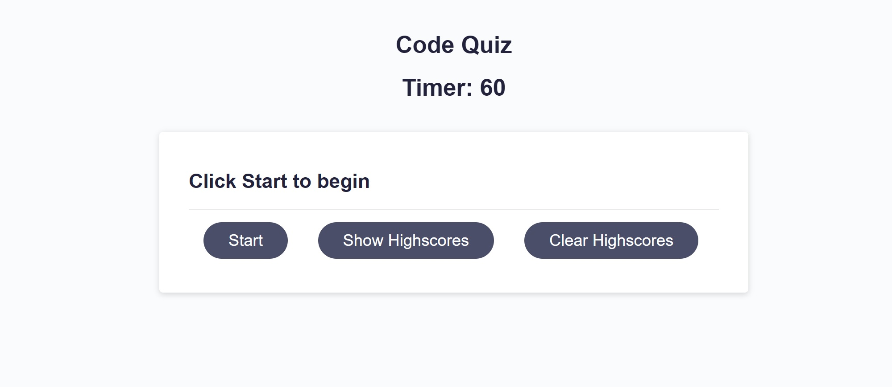
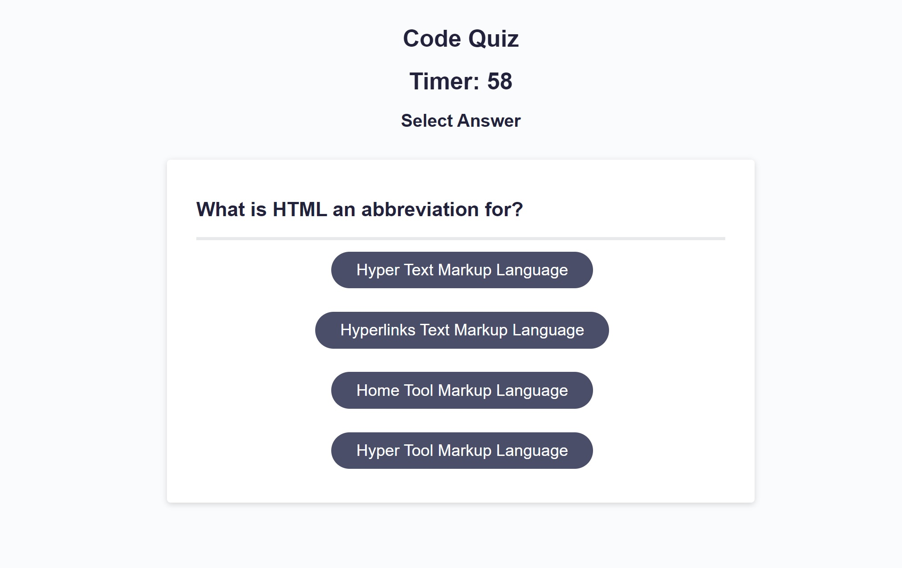
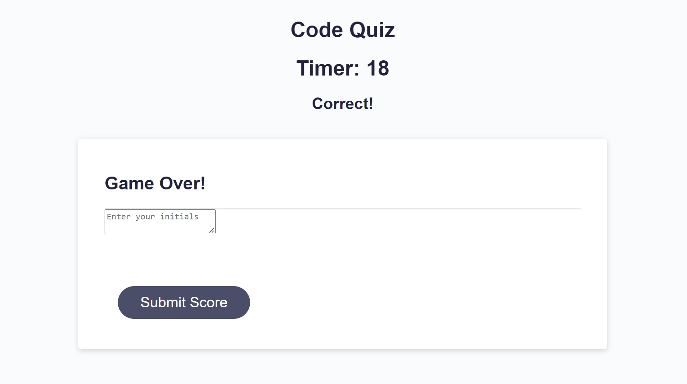
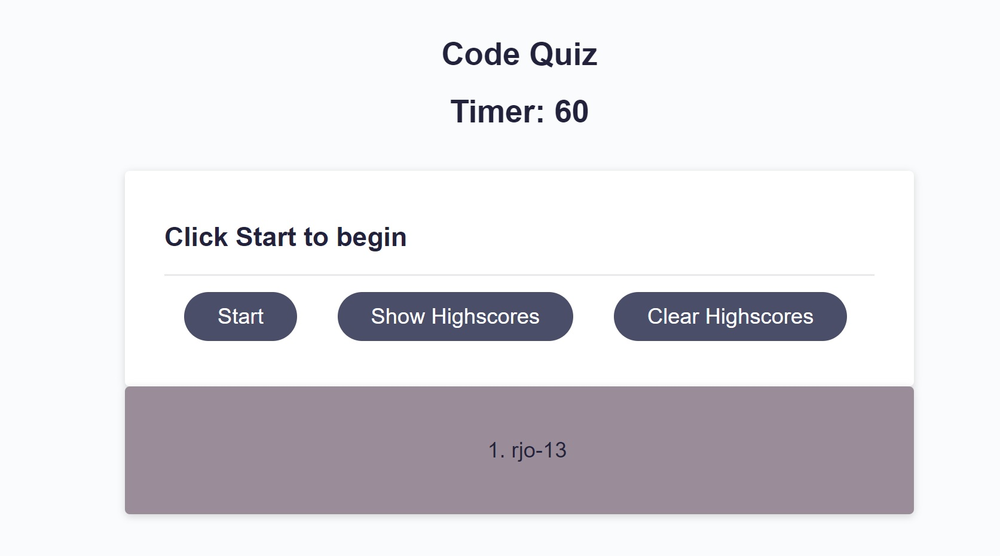

# Code-Quiz

## Description

While learning web development it is important to understand and utalize javascript and API.
This project allowed me to display my skills in javascript through the creation of a code quiz.

## Table of Contents

- [Installation](#installation)
- [Usage](#usage)
- [Credits](#credits)
- [License](#license)

## Installation

To run this project, the user needs to open the index.html file in their web browser. It can also be
accessed by utalizing github live pages from this link. https://rjo6615.github.io/Code-Quiz/

## Usage

To use this project, start by clicking the 'Start' button. You will then be presented with a series of multiple choice questions and a 60 second timer will begin. After selecting your answer choice, it will display wheter the choice was wrong or correct above. If the answer is wrong, 10 seconds are deducted from the timer. If the timer reaches 0, it will read 'game over' and you will be prompted to input your initals. Upon returning to the start page, you will be able to click the 'show highscores' button to see you high scores. The 'clear highscores' button will wipe all current high scores. To play again simply click the start button.

Example images are listed below:

## Credits

John Ifert-Miller
https://github.com/johnboy514

## License

N/A